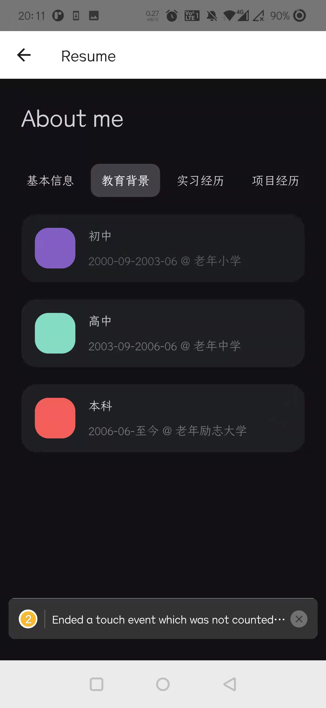
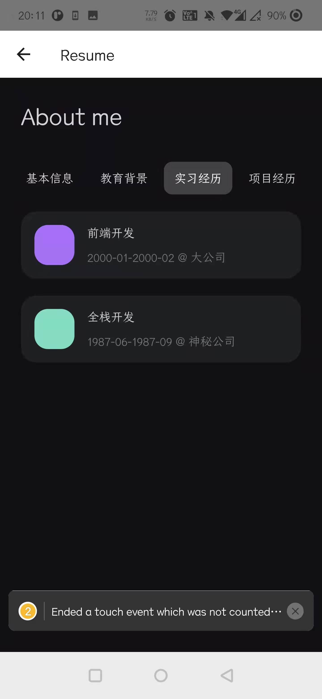
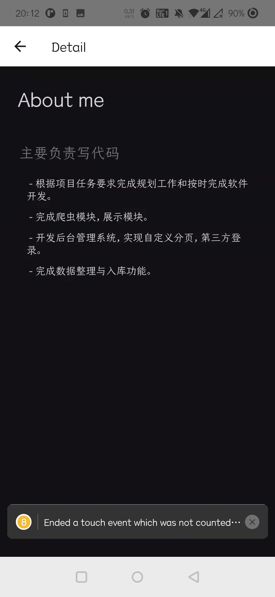
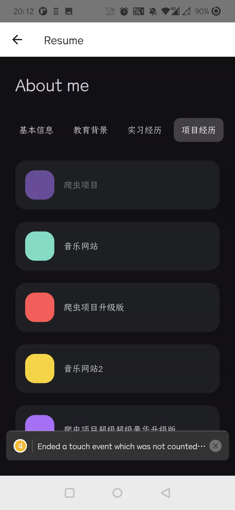

# Resume with RN
## 参考
[TypeScript & React TodoMVC Example](https://github.com/tastejs/todomvc/tree/master/examples/typescript-react)
## 效果

 | 
|:-------------------------:|:-------------------------:|
 | 
| 

## 数据类型

```typescript
type BaseItemType = {
  from: string;
  to: string;
  where: string;
  what: string;
};
// 技能
type Skill = { 
    title: string; percentage: number 
};
// 项目
type Project = { name: string; description?: string; details: string[] };
// 实习经历
type Intern = BaseItemType & {
  description?: string;
  details: string[];
  projects?: Project[];
};
```